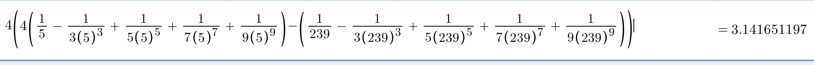

# Pi Examples
A collection of different examples of how to calculate pi using various programming languages.
This uses the arccot/Machin's method:\

You do arccot(5)-arccot(369)\
arccot:\
1/n - 1/(3n^3) + 1/(5n^5) ...

So for n = 4:\
1/4 - 1/(3(4)^3) + 1/(5(4)^5) + 1/(7(4)^7) + 1/(9(4)^9)
1/4 - 1/(12^3) + 1/(20^5) + 1/(28^7) + 1/(36^9)
